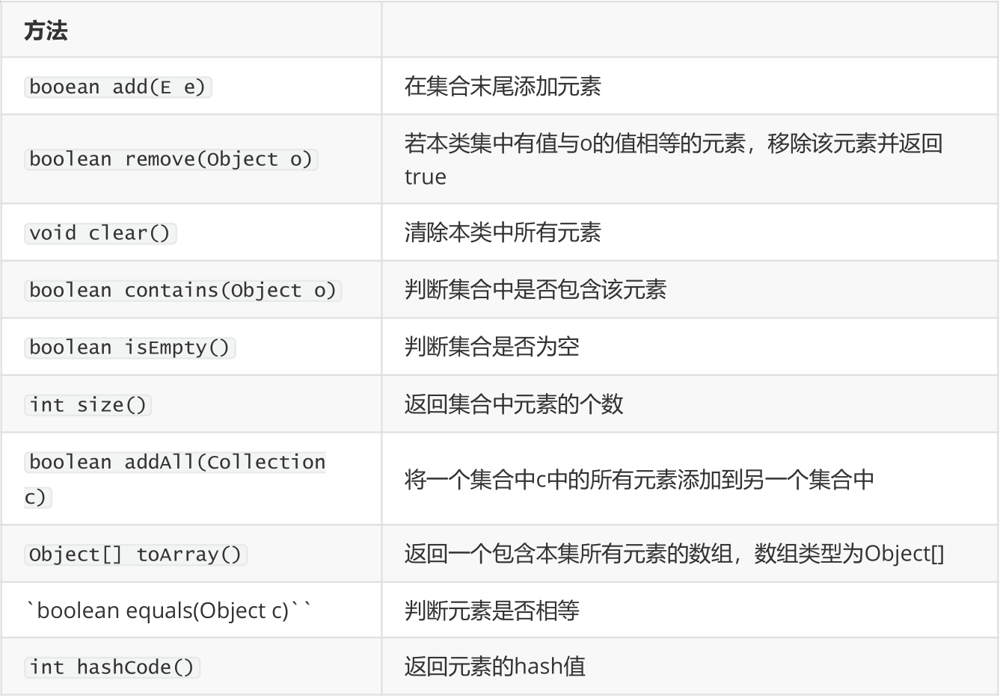
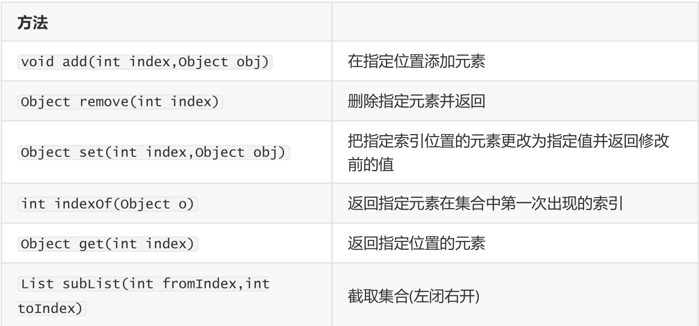
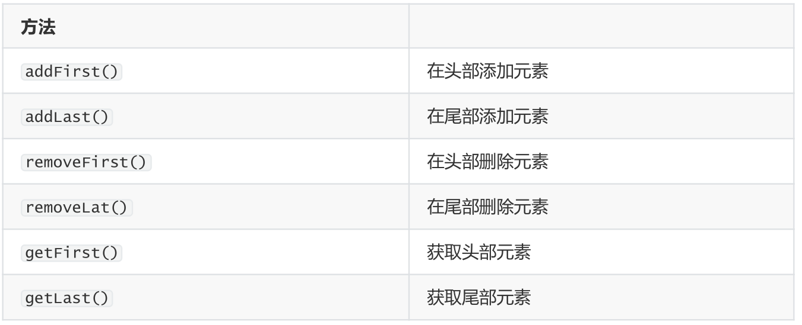
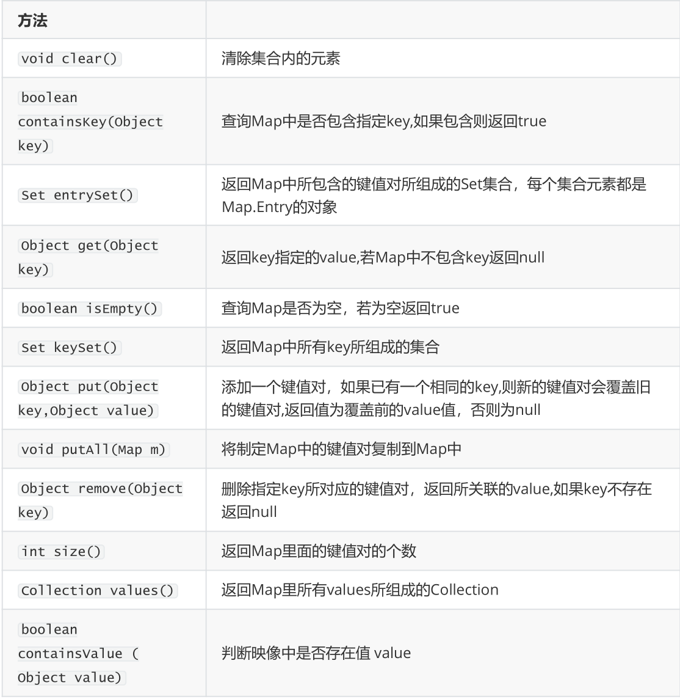
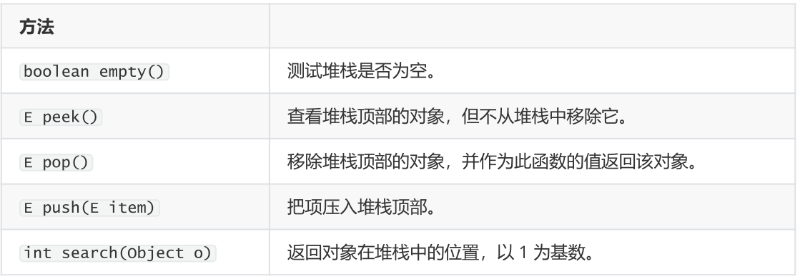
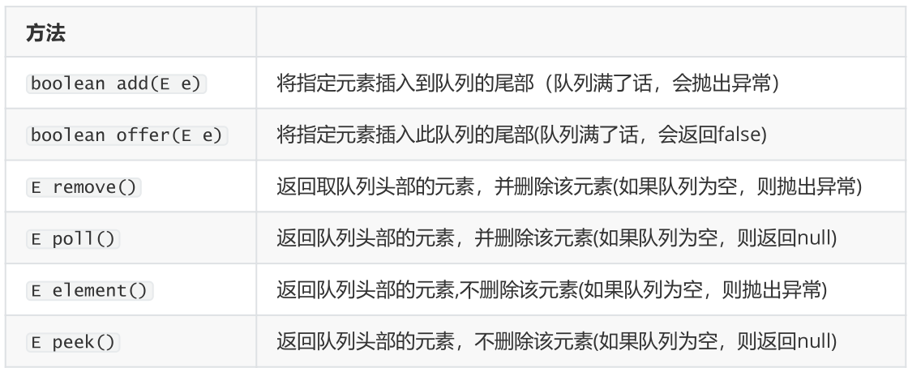

# 1 一、小知识点

  

## 1.1 强制类型转换

  

```java

(int)(Math.pow(matrix.length, 2))

```

  

## 1.2 生成随机数

  

```java

// 生成0~1之间的随机数（浮点数）

Math.random();

(int)(1 + Math.random()*10); // 1~10之间的整数

  

import java.util.Random();

Random random =new Random();

int r1 = random.nextInt(100); // 生成一个0~100的随机数（整型）

```

  

## 1.3 集合常用方法

  

### 1.3.1 Collection

  



  

### 1.3.2 List特有

  



  

### 1.3.3 LinkedList特有

  



  

### 1.3.4 Map特有

  



  

### 1.3.5 Stack特有

  



  

### 1.3.6 Queue特有

  



  

## 1.4 牛客编程特点System.in

  

```java

// 计算a+b的值

import java.util.*;

public class Main{

    public static void main(String[] args){

        Scanner in = new Scanner(System.in);

        while(in.hasNextInt()){

            int a = in.nextInt();

            int b = in.nextInt();

            System.out.println(a + b);

        }

    }

}

```

  

## 1.5 字符串转整型

  

```java
java中的语句integer.parseint（)是将整型数据Integer转换为基本数据类型int

例子：

String str = ＂3＂;

int i = Integer.parseInt(str);

System.out.println(i+1)；//输出4;

String str = ＂3＂;

System.out.println(str+1);//output 31;

integer，整数 / 整型数，与小数 / 浮点数相对，是编程语言的基本数据类型之一，用以指示变量的数据类型，有时也用于常量（变量、表达式）的强制数据类型转换。整型数据的长度及其取值范围并不固定，受编译环境影响。

```

  

## 1.6 字符串转字符数组

  

```java

String strs = "123";

// int arrs = Integer.parseInt(strs);

char[] arrs = strs.toCharArray();

System.out.println(Arrays.toString(arrs));

for (char arr: arrs){

System.out.println(arr);}

```

  

# 2 二、Java刷题笔记——简单题（for 编程题）

  

## 2.1 纯纯的算法

  

### 2.1.1 JZ_10-I:斐波那契数列求第N个数

  

```java

public class App {

  

    public static void main(String[] args) {

        // System.out.println("Hello, World!");

        fibs fibs = new fibs();

  

        int num = fibs.fib(100000001);

        System.out.println(num);

    }

}

  

class fibs {

    public int fib(int n) {

        final int MOD = 100000008;

        if (n < 2) {

            return n;

        }

        // r用来存最新的数；（n_i, n_i+1, n_i+2），因为计算的过程中n_i是没用的，

        // 所以把n_i用来当中转

        int p = 0, q = 0, r = 1;

        for (int i = 2; i <= n; i++) {

            q = p;

            p = r;

            r = (p + q) % MOD;

        }

        return r;

    }

}

```

  

### 2.1.2 JZ_10_II:青蛙跳台阶

  

```java

public class JZ_10_II_Frog {

    /*

    青蛙可以跳一个或者2个台阶，跳上n个台阶共有多少种跳法

     * 思路： 开始时： 跳上一级台阶，此时还剩下f(n-1)种跳法 跳上两级台阶，此时还剩下f(n-2)种跳法 则f(n)=f(n_1) + f(n-2),

     * f(0) = 1, f(1) = 1, f(2) = 2

     */

    public static void main(String[] args) {

        Solution solution = new Solution();

        int num = solution.numWays(7);

        System.out.println("青蛙跳台阶的个数是：" + num);

  

    }

  

}

  

class Solution {

    public int numWays(int n) {

        final int MOD = 1000000007;

        int a = 1, b = 1, sum;

        for (int i = 0; i < n; i++) {

            sum = (a + b) % MOD;

            a = b;

            b = sum;

        }

        return a;

    }

}

```

  

### 2.1.3 JZ_15:求整数对应的二进制数1的个数

  

```java

package JZ_15;

public class JZ_15 {

    /* 编写一个函数，输入是一个无符号整数（以二进制串的形式），返回其二进制表达式中数字位数为 '1' 的个数（也被称为 汉明重量).）。 */

    public static void main(String[] args){

        Solution15 solution15 = new Solution15();

        int ret = solution15.hammingWeight(11);

        System.out.println(ret);

    }

}

  

class Solution15 {

    // you need to treat n as an unsigned value

    public int hammingWeight(int n) {

        /* 循环检查二进制位 */

        int ret = 0;

        for (int i =0; i < 32; i++){

            // &是按位与运算，1 << i是将1左移i位。如果n与左移之后的1按位相与之后为1的话，说明第i位肯定是个1。

            if ((n & (1 << i )) != 0){

                ret++;

            }

  

        }

        return ret;

    }

}

```

  

### 2.1.4 JZ_17:输出n位数的递增数组

  

```java

package JZ_17;

  

public class JZ_17_from1ton_digitnumber {

    public static void main(String[] args){

        Solution17 solution17 = new Solution17();

        int[] array_sum = solution17.printNumbers(4);

        System.out.println(array_sum.length);

    }

}

class Solution17{

    public int[] printNumbers(int n) {

        int sum = 9;

        int incerment = 10;

        for (int i =1; i<n; i++){

            // 9+10*9+100*9

            sum = sum + incerment*9;

            incerment = incerment * 10;

        }

  

        int[] array_sum = new int[sum];

        for (int i =0; i< sum ;i++){

            array_sum[i] = i+1;

        }

        return array_sum;

    }

}

```

  

#### 2.1.4.1 数组初始化及输出

  

```java

// 静态初始化

String[] name = new String[]{"PPT", "WORD", "EXCEL"};

int[] array = new int[]{1, 2, 3, 4, 5};

//动态初始化

int[] array = new int[999];

  

// 数组的遍历打印的三种方法

int[] array = new int[]{1, 2, 3, 4, 5};

// 传统的for循环

for (int i = 0; i < array.length;  i++){

    System.out.println(array[i]);}

// for each

for (int a:array){

    System.out.println(a);

}

// toString方法

System.out.println(Arrays.toString(array));  //需要import java.util.Arrays;

```

  

### 2.1.5 JZ_21:调整数组顺序使奇数位于偶数前面

  

```java

package JZ_21;

  

import java.util.*;

  

public class JZ_21_ODDBeforeEVEN {

    /*

     * 输入一个整数数组，实现一个函数来调整该数组中数字的顺序，使得所有奇数位于数组的前半部分，所有偶数位于数组的后半部分。 输入：nums =

     * [1,2,3,4] 输出：[1,3,2,4] 注：[3,1,2,4] 也是正确的答案之一。

     */

    public static void main(String[] args) {

        int[] nums = new int[] { 1, 2, 3, 4, 6, 7, 8, 9, 1, 2 };

        Solution solution = new Solution();

        int[] newnums = solution.exchange(nums);

        System.out.println(Arrays.toString(newnums));

        System.out.println(1&1);

  

    }

}

  

class Solution {

    public int[] exchange(int[] nums) {

        int left = 0, right = nums.length - 1, tem;

        while (left < right) {

            while (left < right && nums[left] % 2 == 1)

                left++;

            while (left < right && nums[right] % 2 == 0)

                right--;

            tem = nums[left];

            nums[left] = nums[right];

            nums[right] = tem;

        }

        return nums;

  

    }

}

```

  

### 2.1.6 JZ_28:顺时针打印数组

  

```java

package JZ_29;

  

import java.util.Arrays;

  

public class JZ_29_printmatrix {

    /*

     * 输入一个矩阵，按照从外向里以顺时针的顺序依次打印出每一个数字。 输入：matrix = [[1,2,3],[4,5,6],[7,8,9]]

     * 输出：[1,2,3,6,9,8,7,4,5]

     */

    public static void main(String[] args) {

        int[][] matrix = new int[][] { { 1, 2, 3 }, { 4, 5, 6 }, { 7, 8, 9 } };

        Solution solution = new Solution();

        int[] m_arr = solution.spiralOrder(matrix);

        System.out.println(Arrays.toString(m_arr));

    }

  

}

  

class Solution {

    public int[] spiralOrder(int[][] matrix) {

        if (matrix.length == 0)

            return new int[0];

        int l = 0, r = matrix[0].length - 1, t = 0, b = matrix.length - 1, x = 0;

        int[] res = new int[(r+1)*(b+1)];

        while (true) {

            for (int i = l; i <= r; i++)

                res[x++] = matrix[t][i]; // 从左到右, t代表行数

            if (++t > b)

                break;

            for (int i = t; i <= b; i++)

                res[x++] = matrix[i][r]; // top to bottom，r代表列

            if (l > --r)

                break;

            for (int i = r; i >= l; i--)

                res[x++] = matrix[b][i]; // right to left.

            if (t > --b)

                break;

            for (int i = b; i >= t; i--)

                res[x++] = matrix[i][l]; // bottom to top.

            if (++l > r)

                break;

  

        }

        return res;

    }

}

```

  

### 2.1.7 JZ_40_TopK问题

  

```java

package JZ_40;

  

import java.util.Arrays;

import java.util.Random;

  

public class JZ_40_LeastNums {

    /* 输入整数数组 arr ，找出其中最小的 k 个数。例如，输入4、5、1、6、2、7、3、8这8个数字，则最小的4个数字是1、2、3、4。 */

    public static void main(String[] args) {

        int[] arr = new int[] { 1, 2, 3, 2, 2, 2, 5, 4, 2 };

        Solution solution = new Solution();

        int k = 5;

        // int[] LeastKnums = solution.getLeastNumbers(arr, k);

        // System.out.println(Arrays.toString(LeastKnums));

  

        // 快速排序方法

        int[] LeastKnumsqk = solution.getLeastNumbersqk(arr, k);

        System.out.println(Arrays.toString(LeastKnumsqk));

  

        /* 随机数生成 */

        System.out.println("随机数" + (int) (1 + Math.random() * 10));

        Random random = new Random();

        int r1 = random.nextInt(100);

        System.out.println("util.Random()生成的随机数：" + r1);

  

    }

  

}

  

class Solution {

    public int[] getLeastNumbers(int[] arr, int k) {

  

        Arrays.sort(arr);

        int[] LeastKnums = new int[k];

        for (int i = 0; i < k; i++) {

            LeastKnums[i] = arr[i];

        }

        return LeastKnums;

    }

  

    public int[] getLeastNumbersqk(int[] arr, int k) {

        randomizedSelected(arr, 0, arr.length - 1, k);

        int[] vec = new int[k];

        for (int i = 0; i < k; ++i) {

            vec[i] = arr[i];

        }

        return vec;

    }

  

    private void randomizedSelected(int[] arr, int l, int r, int k) {

        if (l >= r) {

            return; // 是个空数组或者？

        }

        int pos = randomizedPartition(arr, l, r); // 先取一个随机数快速排序一趟， l=0, r = arr.length-1

        int num = pos - l + 1; // 算一下排好序的数前边有多少个数

        if (k == num) {

            return;

        } else if (k < num) {

            randomizedSelected(arr, l, pos - 1, k);

        } else {

            randomizedSelected(arr, pos + 1, r, k - num);

        }

    }

  

    private int randomizedPartition(int[] nums, int l, int r) {

        int i = new Random().nextInt(r - l + 1) + l; // 生成l~r之间的随机数

        swap(nums, r, i); // 将随机位置的数与右端的数进行交换

        return partition(nums, l, r);

    }

  

    // 一趟快速排序，

    private int partition(int[] nums, int l, int r) {

        int pivot = nums[r];

        int i = l - 1;

        for (int j = l; j <= r - 1; ++j) {

            if (nums[j] <= pivot) {

                i = i + 1;

                swap(nums, i, j);

            }

        }

        swap(nums, i + 1, r);

        return i + 1;

  

    }

  

    // 交换两个元素的位置

    private void swap(int[] nums, int i, int j) {

        int temp = nums[i];

        nums[i] = nums[j];

        nums[j] = temp;

    }

  

}

```

  

### 2.1.8 JZ_42:最大连续子数组的和

  

```java

package JZ_42;

  

public class JZ_42_MAXSubArr {

    public static void main(String[] args) {

        int[] arr = new int[] { -2, 1, -3, 4, -1, 2, 1, -5, 4 };

        Solution solution = new Solution();

        int maxans = solution.MaxSubArray(arr);

        System.out.println(maxans);

    }

  

}

  

class Solution {

    public int MaxSubArray(int[] nums) {

        int pre = 0, MaxAns = nums[0]; // pre；maxans存当前连续

        for (int x : nums) {

            pre = Math.max(pre + x, x);

            MaxAns = Math.max(pre, MaxAns);

        }

        return MaxAns;

    }

}

```

  

## 2.2 Map

  

包括HashMap, TreeMap, Hashtable, SortedMap, Collection, Set

  

### 2.2.1 方法

  

size next() hasNext() keySet（）

  

```java

import java.util.HashMap; //导入需要的包

import java.util.Iterator;

import java.util.Map;

import java.util.Set;

  

public class basicusage {

    public static void main(String[] args) {

        Map<String, Integer> map = new HashMap<String, Integer>();

        map.put("lixian", 24); //关联键值对

        map.put("zhangsan", 25);

        System.out.println("当前Map的大小是：" + map.size()); //输出大小

        System.out.println("当前Map是否为空：" + map.isEmpty()); //输出map是否为空

        System.out.println("当前Map是否存在键“lixian”：" + map.containsKey("lixian")); //判断是否存在某一个键

        System.out.println("”lixian“对应的value是：" + map.get("lixian")); //获得键对应的值

        System.out.println(map.remove("zhangsan")); //删除指定的键值对

        Map map2 = new HashMap<>();

        map2.putAll(map); //将所有的映射关系从map添加到map2

        System.out.println("map HashMap:" + map);

        System.out.println("putAll之后的map2 HashMap:" + map2);

        map.clear();

        System.out.println("After clear map HashMap:" + map);

        map.put("lixian", 24);

        map.put("liudehua", 56);

        map.put("zhoujielun", 40);

        System.out.println(map.keySet()); //返回所有键的集合

        // 遍历Map

        System.out.println("\n遍历Map得到：");

        Set<String> keys = map.keySet();

        // 获取迭代器

        /* 迭代器的常用内部方法

        next()

        hasNext()

        remove()

         */

        Iterator<String> st = keys.iterator();

        for (String key:keys){

            String st1 = key;

            Integer value = map.get(st1);

            System.out.println("valus:" + value);

        }

        System.out.println("*******迭代器学习");

        while (st.hasNext()){

            System.out.println("使用迭代器输出Map: " + st.next());

        }

  

    }    

}

/*

当前Map的大小是：2

当前Map是否为空：false

当前Map是否存在键“lixian”：true

”lixian“对应的value是：24

25

map HashMap:{lixian=24}

putAll之后的map2 HashMap:{lixian=24}

After clear map HashMap:{}

[lixian, zhoujielun, liudehua]

  

遍历Map得到：

valus:24

valus:40

valus:56

*******迭代器学习

使用迭代器输出Maplixian

使用迭代器输出Mapzhoujielun

使用迭代器输出Mapliudehua

*/

```

  

### 2.2.2 TreeNode

  

- 每个节点要么是黑色，要么是红色。（节点非黑即红）

- 根节点是黑色。

- 每个叶子节点（NIL）是黑色。

- 如果一个节点是红色的，则它的子节点必须是黑色的。（也就是说父子节点不能同时为红色）

- 从一个节点到该节点的子孙节点的所有路径上包含相同数目的黑节点。（这一点是平衡的关键）

  

### 2.2.3 JZ07:重建二叉树（递归形式）:evergreen_tree:

  

已知前序遍历、中序遍历，输出树

  

```java

/**

 * Definition for a binary tree node.

 * public class TreeNode {

 *     int val;

 *     TreeNode left;

 *     TreeNode right;

 *     TreeNode(int x) { val = x; }

 * }

 */

class Solution {

    //递归的思路

    private Map<Integer, Integer> indexMap;

    public TreeNode myBuildTree(int[] preorder, int[] inorder, int preorder_left, int preorder_right, int inorder_left, int inorder_right){

        if (preorder_left > preorder_right){

            return null; //两端为空，即没有树了

        }

        // 根节点:先序遍历的第一个就是

        int preorder_root = preorder_left;

        int inorder_root = indexMap.get(preorder[preorder_root]);

        //建立树的根节点

        TreeNode root = new TreeNode(preorder[preorder_root]);

        //左子树里面的结点数量

        int size_left_subtree = inorder_root-inorder_left;

        //递归构建左子树

        root.left = myBuildTree(preorder, inorder, preorder_left+1, preorder_left+size_left_subtree, inorder_left, inorder_root-1);

  

        root.right = myBuildTree(preorder, inorder, preorder_left+size_left_subtree+1, preorder_right, inorder_root + 1, inorder_right);

        return root;

    }

  

    public TreeNode buildTree(int[] preorder, int[] inorder) {

        int n = preorder.length;

        //构造哈希映射，定位根节点

        indexMap = new HashMap<Integer, Integer>();

  

        for (int i = 0; i < n; i++){

            indexMap.put(inorder[i], i);

        }

        return myBuildTree(preorder, inorder, 0, n-1, 0, n-1);

    }

}

```

  

### 2.2.4 JZ27:二叉树的镜像翻转

  

```java

/**

 * Definition for a binary tree node. public class TreeNode { int val; TreeNode

 * left; TreeNode right; TreeNode(int x) { val = x; } }

 */

/* 请完成一个函数，输入一个二叉树，该函数输出它的镜像。

输入：root = [4,2,7,1,3,6,9]

输出：[4,7,2,9,6,3,1] */

class Solution {

    public TreeNode mirrorTree(TreeNode root) {

        if(root == null) return null;

        TreeNode left = mirrorTree(root.left);

        TreeNode right = mirrorTree(root.right);

        root.left = right;

        root.right = left;

        return root;

  

    }

}

```

  

### 2.2.5 JZ_28:判断二叉树是不是对称的

  

```java

/* 请实现一个函数，用来判断一棵二叉树是不是对称的。如果一棵二叉树和它的镜像一样，那么它是对称的。

例如，二叉树 [1,2,2,3,4,4,3] 是对称的。 */

class Solution {

    public boolean isSymmetric(TreeNode root){

        return root == null? true : recur(root.left, root.right);

    }

    boolean recur(TreeNode L, TreeNode R){

        if (L== null && R == null) return true; //只有单个结点，属于对称树

        if (L==null || R==null || L.val ! = R.val) return false; //

        return recur(L.left, R.right) && recur(L.right, R.left);

    }

}

```

  

## 2.3 Stack

  

### 2.3.1 Stack的初始化及基本操作

  

```java

//定义方式1

Stack<Integer> A, B;

public MinStack() {

    A = new Stack<>();

    B = new Stack<>();

}

//定义方式2

Stack<Integer> A=new Stack<>();

  

//基本操作

Stack<Integer> test = new Stack<>();

test.push(2);

test.push(3);

int peek = test.peek();

System.out.println("当前的栈顶元素是："+peek);

test.pop();

Integer peek1 = test.peek();

System.out.println("当前的栈顶元素是："+peek1);

System.out.println("当前栈判空情况："+test.empty());

```

  

### 2.3.2 JZ06:从尾到头打印链表:last_quarter_moon:

  

```java

class Solution {

    public int[] reversePrint(ListNode head) {

        //初始化一个栈

        Stack<ListNode> stack = new Stack<ListNode>();

        //将链表的头赋值给temp，将temp入栈，并且遍历链表后续的数据

        ListNode temp = head;

        while (temp != null){

            stack.push(temp);

            temp = temp.next;

        }

        int size = stack.size();

        int[] print = new int[size];

        for (int i = 0; i<size; i++){

            print[i] = stack.pop().val;// 栈的值赋给print数组

        }

        return print;

    }

}

```

  

### 2.3.3 JZ_30:$O(1)$的复杂度输出栈中的最小值

  

```java

package JZ_30;

  

import java.util.Stack;

  

public class JZ30_mininStack {

    public static void main(String[] args) {

        MinStack minStack = new MinStack();

        minStack.push(1);

        minStack.push(2);

        minStack.push(4);

        minStack.push(2);

        System.out.println("当前minStack栈的最小值是： " + minStack.min());

    }

}

  

class MinStack {

  

    Stack<Integer> A, B;

    /** initialize your data structure here. */

    public MinStack() {

        A = new Stack<>();

        B = new Stack<>();

    }

  

    public void push(int x) {

        A.add(x);

        if(B.empty() || B.peek() >= x)

            B.add(x);

    }

    public void pop() {

        if(A.pop().equals(B.peek()))

            B.pop();

    }

    public int top() {

        return A.peek();

    }

    public int min() {

        return B.peek();

    }

}

  

/**

 * Your MinStack object will be instantiated and called as such: MinStack obj =

 * new MinStack(); obj.push(x); obj.pop(); int param_3 = obj.top(); int param_4

 * = obj.min();

 */

```

  

## 2.4 Queue

  

### 2.4.1 方法

  

|Method：抛出异常/为空时抛出null,false|Description|等效的Deque()|对应的栈方法|

| :-----------------------------------: | :------------: | -------------------------| ------------|

|add(e)/offer(e)|插入|addLast(e)/offerLast(e)||

|remove()/poll()|删除|removeFirst()/pollFirst()|pop()|

|element()/peek()|检查(返回队头)|getFirst()/peekFirst()|peek()|

|||addFirst(e)|push(e)|

|||||

  

### 2.4.2 JZ09:用两个栈实现队列

  

```java

class CQueue {

    /*

    思路：两个栈，一个负责支持插入操作，一个负责删除操作；

    第一个栈的底部元素是最后插入的元素，第一个栈的顶部元素是下一个待删除的元素；

    第二个栈维护待删除的元素，如果该栈为空，则将第一个栈的栈顶元素弹出到第二个栈里面，则第二个栈的元素的顺序就是待删除元素的顺序。

     */

    //

    Deque<Integer> stack1;

    Deque<Integer> stack2;

    public CQueue() {

        stack1 = new LinkedList<Integer>();

        stack2 = new LinkedList<Integer>();

    }

    public void appendTail(int value) {

        stack1.push(value);

    }

    public int deleteHead() {

        //如果栈2为空，将栈1的元素出栈并且入栈2,

        if (stack2.isEmpty()){

            while(!stack1.isEmpty()){

                stack2.push(stack1.pop());

            }

        }

        //将栈2元素出栈

        if (stack2.isEmpty()){

            return -1;

        }else{

            int deleteItem = stack2.pop();

            return deleteItem;

        }

  

    }

}

  

/**

 * Your CQueue object will be instantiated and called as such:

 * CQueue obj = new CQueue();

 * obj.appendTail(value);

 * int param_2 = obj.deleteHead();

 输入

["CQueue","appendTail","deleteHead","deleteHead","deleteHead"]

[[],[3],[],[],[]]

输出

[null,null,3,-1,-1]

预期结果

[null,null,3,-1,-1]

 */

```

  

## 2.5 ListNode

  

### 2.5.1 JZ_18:删除链表的结点

  

```java

package JZ_18;

/* 实现一个ListNode并且插入删除等基本操作 */

  

public class JZ_18delchainlistnode {

    public static void main(String[] args) {

        int[] arr = new int[] { 4, 5, 1, 9, 6, 3, 7, 8, 2 };

        Solution solution = new Solution();

        ListNode myListNode = solution.initLN(arr); // 初始化LN

        System.out.println("初始化之后的LN是：");

        solution.print(myListNode); // 打印LN

  

        solution.deleteNode(myListNode, 5);

        System.out.println("删除结点5之后的LN是：");

        solution.print(myListNode); // 打印LN

  

        // ListNode valnode = new ListNode(4);

        /* 在最尾部插入不行，看看含义 */

        solution.insertNode(myListNode, 4, 10);

        System.out.println("插入结点10之后的LN是：");

        solution.print(myListNode); // 打印LN

    }

  

}

  

/**

 * Definition for singly-linked list. public class ListNode { int val; ListNode

 * next; ListNode(int x) { val = x; } }

 */

class Solution {

    /* 从数组初始化一个ListNode */

    public ListNode initLN(int[] arr) {

        /* ListNode的初始化 */

        ListNode nextNode; // 指示当前结点

        ListNode head = new ListNode(arr[0]);

        nextNode = head; // 指向头结点

        // 追加结点

        for (int i = 1; i < arr.length; i++) {

            ListNode node = new ListNode(arr[i]);

            nextNode.next = node;

            nextNode = nextNode.next;

        }

        // 再指向头结点

        nextNode = head;

        return nextNode;

    }

  

    /* 打印输出ListNode所有节点 */

    public void print(ListNode listNode) {

        // 创建链表节点

        while (listNode != null) {

            System.out.println("结点:" + listNode.val);

            listNode = listNode.next;

        }

        System.out.println();

    }

  

    /* 按值删除结点 */

    public ListNode deleteNode(ListNode head, int val) {

        if (head.val == val)

            return head.next; // 如果要删除的结点是头结点

        ListNode pre = head, cur = head.next;

        // 如果链表的值不是需要删除的，那么就是pre指向当前，cur指向下一个

        // 如果发现了这个值是要删除的或者是遍历完了整个LN，就跳出循环，此时cur指向的就是目的结点或者是空，如果指向目的节点就令前一个的next指向cur的next进行删除。

        while (cur != null && cur.val != val) {

            pre = cur;

            cur = cur.next;

        }

        if (cur != null)

            pre.next = cur.next;

        return head;

    }

  

    /* 按值插入节点，在valnode之后插入值aim */

    public ListNode insertNode(ListNode head, int val, int aim) {

        // ListNode valnode = new ListNode(val);

        ListNode aimnode = new ListNode(aim);

        ListNode pre = head, cur = head.next;

        if (head.next == null)

            return head;

        if (pre.val == val) {

            aimnode.next = head.next;

            head.next = aimnode;

            return head;

        }

        while (cur != null) {

            System.out.println("正在遍历LN，pre值为：" + pre.val + "当前cur值:" + cur.val);

  

            if (cur.val == val && pre != null) {

                System.out.println("正在插入结点aimnode，其值为：" + aimnode.val);

                aimnode.next = cur.next; // 新结点指向原来pre的下一个，也就是cur

                // aimnode.next = pre.next; //新结点指向pre的下一个

                cur.next = aimnode; // 新的cur指向新的结点

            }

            pre = cur;

            cur = cur.next;

  

        }

        return head;

    }

}

  

// ListNode的定义

class ListNode { // 类名 ：Java类就是一种自定义的数据结构

    int val; // 数据 ：节点数据

    ListNode next; // 对象 ：引用下一个节点对象。在Java中没有指针的概念，Java中的引用和C语言的指针类似

  

    ListNode(int val) { // 构造方法 ：构造方法和类名相同

        this.val = val; // 把接收的参数赋值给当前类的val变量

    }

}

```

  

### 2.5.2 JZ_22:输出链表倒数第k到最后

  

**链表的定义、由数组生成链表与上个相同，这里只写函数实现**

  

```java

package JZ_22;

    /*

     * 输入一个链表，输出该链表中倒数第k个节点。为了符合大多数人的习惯，本题从1开始计数，即链表的尾节点是倒数第1个节点。

     *

     * 例如，一个链表有 6 个节点，从头节点开始，它们的值依次是 1、2、3、4、5、6。这个链表的倒数第 3 个节点是值为 4 的节点。

     * 给定一个链表: 1->2->3->4->5, 和 k = 2.

     * 返回链表 4->5.

     */

  

/**

 * Definition for singly-linked list. public class ListNode { int val; ListNode

 * next; ListNode(int x) { val = x; } }

 */

class Solution {

    public ListNode getKthFromEnd0(ListNode head, int k) {

        /* 两个思路，一个是顺序查到第n-k个结点即倒数第k个结点 */

        int len = 0;

        ListNode cur = head;

        while(cur != null){

            len = len +1;

            cur = cur.next;

        }

        // System.out.println(len);

        ListNode node = null;

        for (node = head; len>k; len--){

            node = node.next;

        }

        return node;

  

    }

    public ListNode getKthFromEnd1(ListNode head, int k) {

        /* 两个思路，另一个是快慢指针 */

        ListNode fast = head, slow = head;

        while(fast!=null && k>0){

            fast = fast.next;

            k--;

        }

        while(fast!=null){

            fast = fast.next;

            slow = slow.next;

        }

        return slow;

    }

}

```

  

### 2.5.3 JZ_24:逆序输出链表

  

```java

package JZ_24;

    /*

     * 定义一个函数，输入一个链表的头节点，反转该链表并输出反转后链表的头节点。

     * 示例:

     *

     * 输入: 1->2->3->4->5->NULL 输出: 5->4->3->2->1->NULL

     */

/**

 * Definition for singly-linked list. public class ListNode { int val; ListNode

 * next; ListNode(int x) { val = x; } }

 */

class Solution {

    public ListNode reverseList(ListNode head) {

        if (head.next == null)

            return head;

        ListNode pre = head, cur = head.next;

        //先把第一个结点让它指向null，并更新pre, cur

        ListNode temcurnex = cur.next;

        cur.next = pre;

        pre = cur;

        pre.next.next = null;

        cur = temcurnex;

        while (cur != null) {

            ListNode curnex = cur.next;

            cur.next = pre;

            pre = cur;

            cur = curnex;

        }

        return pre;

    }

}

```

  

### 2.5.4 JZ_25:合并两个递增链表

  

```java

package JZ_25;

/* 输入两个递增排序的链表，合并这两个链表并使新链表中的节点仍然是递增排序的。

示例1：

输入：1->2->4, 1->3->4

输出：1->1->2->3->4->4

*/

class Solution {

    // 新建一个链表用来存数据

    public ListNode mergeTwoLists(ListNode l1, ListNode l2) {

        ListNode dum = new ListNode(0), cur = dum;

        // 将l1插入到l2

        // 刚开始cur指向的是dum，后续，cur指向比较小的那一个链表；如果有一个链表遍历完了，就把剩下的链表追加到dum链表。

        while (l1 != null && l2 != null) {

            /* 更新dum链表，选择val小的结点接到dum链表上边 */

            if (l1.val < l2.val) {

                cur.next = l1;

                l1 = l1.next;

            } else {

                cur.next = l2;

                l2 = l2.next;

            }

            cur = cur.next; // 让cur指向dum链表最新的结点

        }

        // 直接把最后非空的那个链表给接过来

        cur.next = l1 != null ? l1 : l2;

        return dum.next;

    }

}

```

  

## 2.6 List

  

### 2.6.1 List基础

  

#### 2.6.1.1 初始化及打印

  

```java

List<Integer> innerList = new ArrayList<Integer>();

int [] loc_nums = new int[]{1, 2, 3,6};

for (int i: loc_nums){

    innerList.add(i);

    // System.out.println(i);

}

  

// 打印：通过迭代器

Iterator loc_it = innerList.iterator();

while(loc_it.hasNext()){

    System.out.println(loc_it.next());

}

  

// 通过for each  loc

for (Integer loc:innerList){

    System.out.println(loc);

}

```

  

#### 2.6.1.2 List\<List\<Integer\>\>

  

```java

//初始化

List<List<Integer>> res = new ArrayList<>();

List<List<Integer>>list =new ArrayList<List<Integer>>();

  

/* 添加list的层和值 */

/* 方法一 */

list.add(new LinkedList<>());  //先添加层数

list.get(0).add(1);          //后在指定层数进行添值:list.get(layers).add(value);

list.add(new LinkedList<>());

list.get(1).add(11);

list.get(1).add(12);  //插入第layers+1层的结尾

list.get(1).add(0,13);//插入第layers+1层的开头

/* 方法二 */

list.add(new LinkedList<>(Arrays.asList(1, 2, 3, 6)));

// list.get(2).add(31);//注明：这种表达是错误的，第三层已经由Arrays.asList赋值，无法使用list.get(2).add(31)这个语句

/* 输出list的层数 */

System.out.println("list的层数为: " + list.size());

  

/*list元素输出*/

System.out.println("方法一：输出list元素");

for (int i = 0; i < list.size(); i++) {

    System.out.println(Arrays.toString(list.get(i).toArray()));

}

System.out.println("方法二：输出list元素");

for (int i = 0; i < list.size(); i++) {

    List<Integer> item = list.get(i);      //item存第i+1层的所有元素

    for (int j = 0; j < item.size(); j++) {

        System.out.print(item.get(j)+",");

    }

    System.out.println();

}

  

/* list元素的删除 */

list.remove(1);//list.remove(i)删除第i+1层所有元素

list.get(1).remove(0); //list.get(i).remove(j)删除第i+1层的第j+1个元素

System.out.println("输出删除后的结果");

for (int i = 0; i < list.size(); i++) {

    System.out.println(Arrays.toString(list.get(i).toArray()));

}

```

  

### 2.6.2 JZ_32:从上到下打印二叉树

  

```java

class Solution {

    public List<List<Integer>> levelOrder(TreeNode root) {

        Queue<TreeNode> queue = new LinkedList<>();

        List<List<Integer>> res = new ArrayList<>();

        if(root != null) queue.add(root);

        while(!queue.isEmpty()) {

            List<Integer> tmp = new ArrayList<>();

            for(int i = queue.size(); i > 0; i--) {

                TreeNode node = queue.poll();

                tmp.add(node.val);

                if(node.left != null) queue.add(node.left);

                if(node.right != null) queue.add(node.right);

            }

            res.add(tmp);

        }

        return res;

    }

}

```

  

## 2.7 String

  

### 2.7.1 String类的常用方法

  

- length() ：返回字符串长度

- charAt() ：返回指定索引处的字符

- substring() ：截取字符串

- trim() ：去除字符串两端空白

- split() ：分割字符串，返回一个分割后的字符串数组。

- replace() ：字符串替换。

- indexOf() ：返回指定字符的索引。

- toLowerCase() ：将字符串转成小写字母。

- toUpperCase() ：将字符串转成大写字符